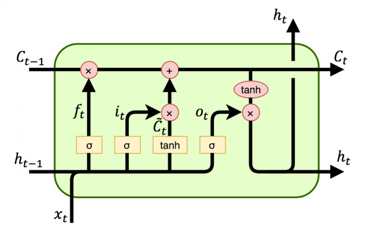

# LSTM

This project implemented `LSTM (Long short-term memory networks)`.  

> **Notation**:  
$h_t$ , $C_t$ : hidden layer vectors.  
$x_t$ : input vector.  
$b_f$ , $b_i$ , $b_c$ , $b_o$ : bias vector.  
$W_f$ , $W_i$ , $W_c$ , $W_o$ : parameter matrices.  
$\sigma$ , $\tanh$ : activation functions.  



## Feed-Forward
$$
\begin{align*}
f_t=\sigma(W_f\cdot[h_{t-1},x_t]+b_f)\\
i_t=\sigma(W_i\cdot[h_{t-1},x_t]+b_i)\\
o_t=\sigma(W_o\cdot[h_{t-1},x_t]+b_o)\\
\tilde{C}_t=\tanh(W_c\cdot[h_{t-1},x_t]+b_c)\\
C_t=f_t\odot C_{t-1}+i_t\odot\tilde{C}_t\\
h_t=o_t\odot\tanh(C_t)
\end{align*}
$$

$$
\begin{align*}
  &\frac{\partial C_{t+1}}{\partial h_t}= \frac{\partial C_{t+1}}{\partial \tilde{C}_{t+1}} \frac{\partial \tilde{C}_{t+1}}{\partial h_t}+ \frac{\partial C_{t+1}}{\partial f_{t+1}} \frac{\partial f_{t+1}}{\partial h_t}+ \frac{\partial C_{t+1}}{\partial t_{t+1}} \frac{\partial i_{t+1}}{\partial h_t}\\ &\frac{\partial C_{t+1}}{\partial C_t}\\ &\frac{\partial h_{t+1}}{\partial C_t}= \frac{\partial h_{t+1}}{\partial C_{t+1}} \frac{\partial C_{t+1}}{\partial C_t}\\ &\frac{\partial h_{t+1}}{\partial h_t}= \frac{\partial h_{t+1}}{\partial C_{t+1}} \frac{\partial C_{t+1}}{\partial h_t}+ \frac{\partial h_{t+1}}{\partial o_{t+1}} \frac{\partial o_{t+1}}{\partial h_t}
\end{align*}
$$

## Backpropagation
$$
\begin{align*}
  \Pi_t= \frac{\partial E_t}{\partial h_t}+ \frac{\partial h_{t+1}}{\partial h_t} \Pi_{t+1}+ \frac{\partial C_{t+1}}{\partial h_t} \mathcal{T}_{t+1}\\
  \mathcal{T}_t= \frac{\partial E_t}{\partial h_t} \frac{\partial E_t}{\partial C_t}+ \frac{\partial h_{t+1}}{\partial C_t} \Pi_{t+1}+ \frac{\partial C_{t+1}}{\partial C_t} \mathcal{T}_{t+1}\\
  \beta_t^f=\beta_{t+1}^f+ \frac{\partial C_t}{\partial f_t} \frac{\partial f_t}{\partial W_t^f} ( \frac{\partial h_t}{\partial C_t} \Pi_t + \mathcal{T}_t )\\
  \beta_t^i=\beta_{t+1}^i+ \frac{\partial C_t}{\partial i_t} \frac{\partial i_t}{\partial W_t^i} ( \frac{\partial h_t}{\partial C_t} \Pi_t + \mathcal{T}_t )\\
  \beta_t^c=\beta_{t+1}^c+ \frac{\partial C_t}{\partial \tilde{C}_{t}} \frac{\partial \tilde{C}_{t}}{\partial W_t^c} ( \frac{\partial h_t}{\partial C_t} \Pi_t + \mathcal{T}_t )\\
  \beta_t^o=\beta_{t+1}^o+ \frac{\partial h_t}{\partial o_t} \frac{\partial o_t}{\partial W_t^o} ( \Pi_t )
\end{align*}
$$

# Setup

## Prerequisite
```
torch
numpy
tqdm
nltk
```

```bash
python run.py
```

# Code Structure

```
lstm
│
│   README.md
│   README.pdf
│   evaluate.py
│   run.py    
│   utils.py   
│   model.py #  
│   
└───data
│   │   eval.csv
│   │   train.csv
│   
└───out
    │   lstm.log 
    │   result.csv
```
